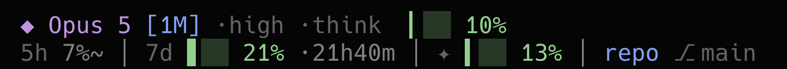

# Claude Code status line

Two-line status line rendered by Bun.



The same thing in plain text, which is what survives where the image does not:

```
◆ Opus 5 [1M] ·xhigh ·think  █▏░ 38%  ⑂ 2×Fable
5h ▎░░ 7% ·2h13m │ 7d ▍░░ 13% ·2d1h │ ✦ ▍░░ 12% │ Architect ⎇ main*
```

| Element | Meaning |
|---|---|
| `◆ Opus 5 [1M]` | Active model; `[1M]` when the context window is 1M rather than 200k |
| `·xhigh ·think ·fast` | Reasoning effort, extended thinking, fast mode |
| `█▏░ 38%` | Main context window fill |
| `⑂ 2×Fable` | Subagents working right now, grouped by model family |
| `5h` / `7d` | Rate-limit windows |
| `✦ 12%` | Fable weekly quota (`~` suffix = value is stale, refresh in flight) |
| `Architect ⎇ main*` | Directory and git branch; `*` means uncommitted changes |

Bar colors compare consumption against elapsed time in the window: green means the remaining
budget outlasts the remaining time, red means it will not. Pacing is suppressed during the
first 10% of a window, where the ratio is pure noise. Color is the *only* pacing signal — there
is no room for a marker glyph in a three-cell bar, and it was duplicating what the color said.

## Requirements

**Bun** is the only hard runtime requirement. `package.json` has an empty `dependencies` object —
there are no runtime npm packages at all, the whole thing runs on Bun's standard library. The two
`devDependencies` (`@types/bun`, `typescript`) exist purely so `tsc --noEmit` has types to work
with; they are never loaded at runtime, which is why `bun install` is optional and `node_modules/`
is gitignored.

**Claude Code** itself, since it is what pipes the JSON payload in on stdin. Run outside of it the
status line still prints — it just prints the empty-payload fallback.

**`git` on `PATH`**, for the dirty flag only. `git.ts` spawns `git status --porcelain=v1` to decide
whether to append `*`; the branch name is read straight out of `.git/HEAD` with no subprocess, so
the branch keeps rendering even when git is missing, slow, or the spawn times out.

**macOS keychain** for the `✦` segment. `usage-refresh.ts` reads the OAuth token with
`security find-generic-password -s 'Claude Code-credentials' -w`. That path is taken only on
`darwin`; on every other platform — and on macOS when the keychain lookup fails or returns
something unparseable — it falls back to reading `claudeAiOauth.accessToken` from
`~/.claude/.credentials.json`. With neither source the refresh writes `error: "no-credentials"` and
the segment simply does not appear.

**Network access to `api.anthropic.com`**, also for `✦` only, and also optional. The fetch happens
in a detached background process; offline, every other segment renders exactly as before and the
quota segment is the only thing that disappears.

**A terminal with UTF-8 and a font covering Block Elements** (`▏▎▍▌▋▊▉█`, plus `░`) and the symbols
`◆ ⑂ ✦ ⎇`. A font without them turns the bars into replacement boxes; the percentages next to them
stay correct either way.

**256-color or truecolor.** `render.ts` emits 24-bit escapes (`38;2;r;g;b`) when `COLORTERM`
matches `truecolor` or `24bit`, and otherwise quantises each color into the xterm 6×6×6 cube and
emits `38;5;n`. Setting `NO_COLOR` to any non-empty value suppresses every escape, including bold
and dim; the layout is unaffected.

## Installation

1. **Install Bun.**

   ```bash
   curl -fsSL https://bun.sh/install | bash
   ```

2. **Clone the repo.** The paths below assume `~/Architect/repo`, which is what the root README
   documents.

   ```bash
   git clone git@github.com:chemix/architect.git ~/Architect/repo
   ```

3. **Optionally install the dev dependencies.** Only needed to typecheck; the status line runs
   without them.

   ```bash
   cd ~/Architect/repo/statusline && bun install
   ```

4. **Point Claude Code at it** by adding a `statusLine` block to `~/.claude/settings.json`:

   ```json
   "statusLine": {
     "type": "command",
     "command": "/Users/chemix/.bun/bin/bun /Users/chemix/Architect/repo/statusline/statusline.ts",
     "padding": 0,
     "refreshInterval": 10
   }
   ```

   Both paths are absolute, and both have to be adjusted if the username or the clone location
   differs. The absolute path to `bun` is deliberate rather than lazy: the command runs in a shell
   that may not have `~/.bun/bin` on `PATH`. The absolute path to `statusline.ts` is needed because
   the working directory is the project being edited, not this repo.

   `refreshInterval` is load-bearing, not cosmetic: event-driven updates go quiet while the main
   session waits on background subagents — exactly when the `⑂` segment matters most.

The change takes effect on the next render; there is nothing to restart. To confirm the command
itself is sound before handing it to Claude Code, run it by hand with an empty payload:

```bash
echo '{}' | /Users/chemix/.bun/bin/bun /Users/chemix/Architect/repo/statusline/statusline.ts
```

It prints `◆ ?  ctx —` (plus the `✦` segment when a quota cache exists) and exits 0.

## Customization

`usage-refresh.ts` defines `const TRACKED_MODEL = 'fable'`, so the `✦` segment reports the **Fable**
weekly quota specifically — the value is matched case-insensitively as a substring against
`scope.model.display_name` in the API response. That is independent of whichever model the session
is actually using: the screenshot above shows Opus 5 as the active model while `✦` tracks Fable.
Anyone who mostly runs Opus should change that constant to `'opus'`.

## Troubleshooting

- **Nothing renders at all.** Check the two absolute paths in `~/.claude/settings.json`, then run
  the command by hand (`echo '{}' | <command>`) and read what it prints. The status line swallows
  its own exceptions on purpose — it must never surface a stack trace into the UI — so a crash
  inside `build()` degrades to a single `◆ <model>` line rather than to nothing.
- **The `✦` segment is missing.** Either there are no credentials or a refresh failed. Inspect
  `cache/usage.json` for an `error` field: `no-credentials`, `network`, `rate-limited`, `parse`, or
  `http-<status>`. Force a refresh by hand with `bun ~/Architect/repo/statusline/usage-refresh.ts`.
- **Bars render as boxes or garbage.** The terminal font lacks Block Elements. The percentages next
  to the bars are still accurate.
- **No colors.** `NO_COLOR` is set to a non-empty value somewhere in the environment; `render.ts`
  honours it and strips every escape.
- **The branch shows but never a `*`.** The `git status` call is failing or timing out — `git.ts`
  gives it a hard 250 ms timeout, and caches the failure as "unknown" for 5 s so a slow repo does
  not re-pay that timeout on every render. Run `git status --porcelain=v1` in that repo and time it.

## Why the bars are three characters wide

Each cell renders at eighth-of-a-cell resolution using Block Elements (`▏▎▍▌▋▊▉█`), so three
cells carry **24 levels**, not 4. That precision is load-bearing rather than decorative: the
rate-limit windows spend most of their life in the 0–15% band, and with whole-cell blocks 0%, 3%,
7% and 13% all render as an identical empty bar.

Two rules in `bar()` keep it from lying:

- a non-zero reading always fills at least one eighth, so 0.4% never looks like 0%
- anything under 100% is capped one eighth short of solid, so `███` means genuinely full

```
  0% ░░░      38% █▏░
  3% ▏░░      50% █▌░
  7% ▎░░      77% ██▎
 13% ▍░░     100% ███
```

## Files

| File | Role |
|---|---|
| `statusline.ts` | Entry point — reads stdin JSON, assembles both lines |
| `input.ts` | stdin payload types and defensive coercion |
| `models.ts` | Model id → display label |
| `render.ts` | Colors, bars, pacing, duration formatting, width fitting |
| `git.ts` | Branch (via `.git/HEAD`) and dirty flag (cached `git status`) |
| `subagents.ts` | Live subagent detection |
| `usage.ts` | Fable quota cache reader; spawns refresh when stale |
| `usage-refresh.ts` | Detached background fetch of `/api/oauth/usage` |
| `cache/` | `usage.json` (180s TTL) and `usage.lock` (30s min gap, 300s after a 429) |
| `docs/screenshot.png` | The screenshot embedded at the top of this file |

## Data sources

Everything except the Fable quota comes from the JSON Claude Code pipes in on stdin — the 5h and
7d windows included, so those are always fresh and cost nothing.

The Fable weekly quota is not on stdin. It comes from `GET https://api.anthropic.com/api/oauth/usage`
using the OAuth token in the macOS keychain (`Claude Code-credentials`). Two things to know about
that response:

- Per-model quotas live in `limits[]` as `kind: "weekly_scoped"`, matched on
  `scope.model.display_name`. The flat `seven_day_opus` / `seven_day_sonnet` keys return `null`
  even for models with real usage, so they are only a fallback.
- An entry with `percent: 0` and `resets_at: null` is a placeholder, not a real window, and is
  discarded — otherwise the bar shows a confident 0% for a quota we know nothing about.

There is no monthly rate-limit window. The only monthly figure is `extra_usage` (a spend cap,
cached but not displayed while it is disabled on this account).

Timestamps arrive in two encodings: `rate_limits.*.resets_at` on stdin is unix epoch **seconds**,
while `resets_at` from the usage API is an **ISO 8601 string**. `toEpochMs` in `input.ts` handles
both. (Verified against live data: stdin `1786096800` and the API's `2026-08-07T10:00:00Z` are the
same instant.)

Claude Code refreshes `rate_limits` only on an API response, so an idle session keeps serving
numbers from a window that has already rolled over — observed in the wild as `23%` attached to a
5-hour reset 14 hours in the past. When `resets_at` is already behind us the window renders as a
greyed `5h 23%~` with no bar, rather than a confident percentage that is no longer true.

`model.display_name` may carry a trailing qualifier (`"Opus 5 (1M context)"`). It is stripped —
the `[1M]` badge is derived from `context_window_size`, so keeping both would duplicate it.

## Why the network never blocks

The status line runs on every assistant message. `usage.ts` only reads the local cache; when it is
older than 180s it spawns `usage-refresh.ts` detached and renders the stale value immediately. A
lock file caps refresh attempts at one per 30s across all sessions.

## Testing

```bash
echo '{"model":{"id":"claude-opus-5","display_name":"Opus 5"},
       "context_window":{"used_percentage":38,"context_window_size":1000000},
       "effort":{"level":"xhigh"},
       "rate_limits":{"five_hour":{"used_percentage":7,"resets_at":1785940000}}}' \
  | bun ~/Architect/repo/statusline/statusline.ts
```

Worth covering: missing `rate_limits` (before the first API response), `used_percentage: null`
(fresh session and right after `/compact`), `{}`, and `COLUMNS=60`. Every case must print without
throwing; segments drop from the end of each line when the terminal is too narrow.

Force a usage refresh with `bun ~/Architect/repo/statusline/usage-refresh.ts` and inspect
`cache/usage.json`.
